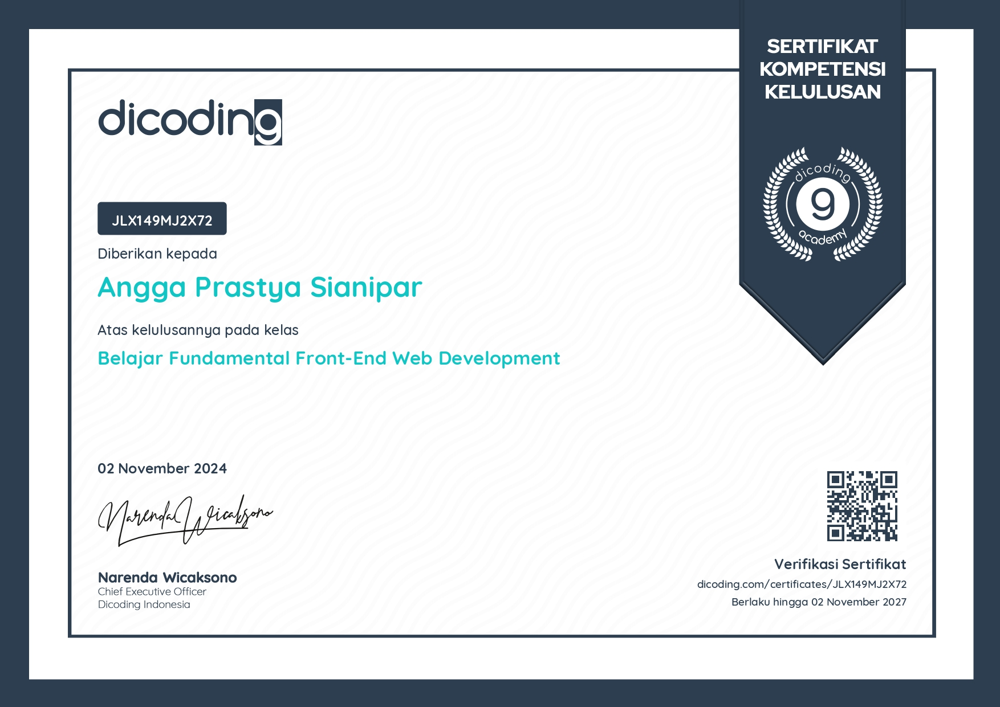
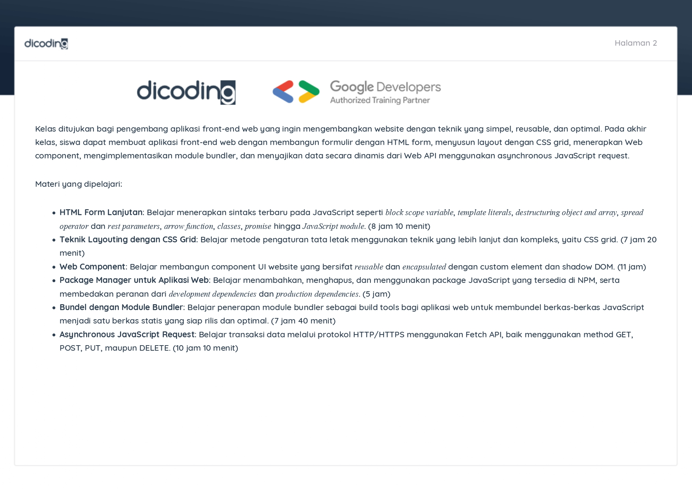
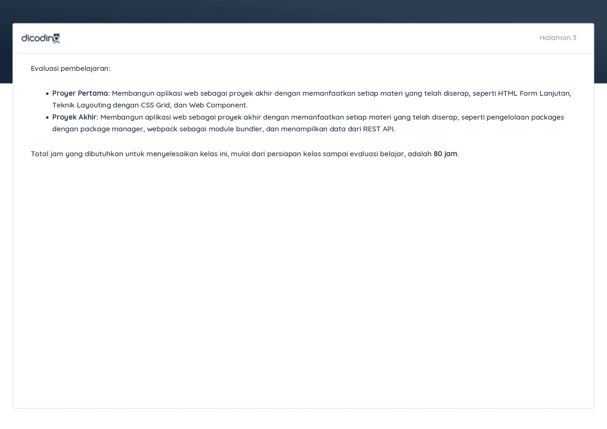

## 📜 Deskripsi Sertifikasi Kompetensi

Sertifikat dengan nomor **JLX149MJ2X72** ini diterbitkan oleh **Dicoding Indonesia** selaku **Google Developers Authorized Training Partner**. Kredensial tingkat menengah (*Intermediate*) ini memvalidasi kapabilitas standar industri dalam membangun aplikasi front-end web yang dinamis, terstruktur, optimal, serta menerapkan komponen antarmuka yang bersifat *reusable* dan *encapsulated*.

---

### 🏛️ Kompetensi Inti yang Divalidasi
Kurikulum kurasi mendalam sepanjang **80 Jam** ini mencakup penguasaan aspek arsitektur front-end modern:
* **Sintaksis JavaScript Modern (ES6+)**: Menguasai dan menerapkan fitur modern seperti *block scope variable, template literals, destructuring object & array, spread operator, rest parameters, arrow function, JavaScript Classes, Promise*, hingga *JavaScript Modules*.
* **Teknik Layouting Lanjut (CSS Grid)**: Mahir menyusun tata letak tata ruang dan grid antarmuka web yang kompleks, responsif, dan fleksibel menggunakan metode *CSS Grid System*.
* **Arsitektur Web Component**: Membangun komponen UI (*User Interface*) kustom yang bersifat *reusable* (dapat digunakan kembali) dan *encapsulated* (terisolasi) memanfaatkan teknologi *custom elements* dan *Shadow DOM*.
* **Manajemen Package & Build Tools (Webpack)**: Mengelola dependensi proyek (*development & production dependencies*) via Node Package Manager (NPM) serta mahir menerapkan *Webpack* sebagai *module bundler* untuk menyatukan dan mengoptimalkan aset kode menjadi berkas statis siap rilis.
* **Asynchronous Request & REST API**: Melakukan transaksi data dinamis secara asinkronus dengan *Web Server* melalui protokol HTTP/HTTPS menggunakan *Fetch API* (mengimplementasikan metode *GET, POST, PUT,* dan *DELETE*).

---

### 🛠️ Proyek Akhir Kelulusan (Submissions)
Untuk berhak mendapatkan kelulusan, saya telah menyelesaikan dua proyek implementation nyata:
1. **Proyek Pertama**: Membangun aplikasi web interaktif dengan memanfaatkan fitur *HTML Form* lanjutan, teknik tata letak *CSS Grid*, dan enkapsulasi *Web Component*.
2. **Proyek Kedua (Utama)**: Mengembangkan aplikasi web dinamis yang mengintegrasikan manajemen package NPM, pembundelan aset otomatis via *Webpack*, serta penyajian data real-time yang dikonsumsi langsung dari *REST API* menggunakan operasi asynchronous JavaScript.

> [!SUCCESS] Masa Berlaku Kredensial
> Sertifikat ini ditetapkan pada **02 November 2024** dan berlaku selama **3 (tiga) tahun** hingga 02 November 2027 di bawah otoritas Narenda Wicaksono selaku Chief Executive Officer Dicoding Indonesia.

  &times;
  
  &#10094;
  &#10095;

  

