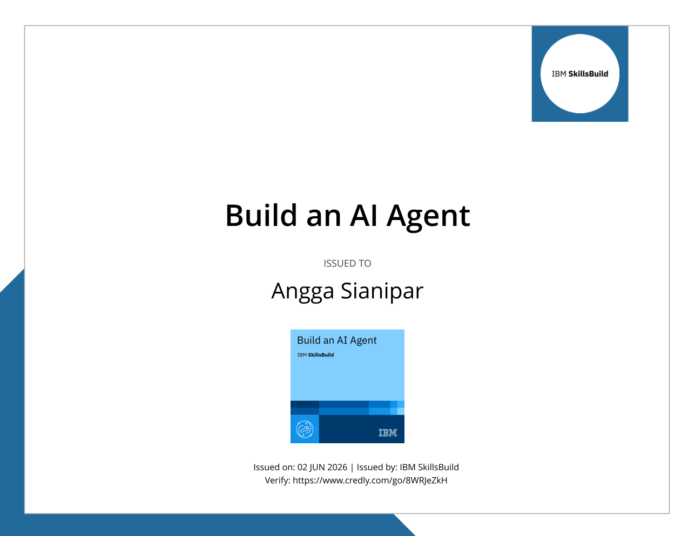

## Deskripsi Sertifikasi Kompetensi

Sertifikat ini diterbitkan untuk **Angga Sianipar** sebagai pengakuan atas keberhasilan menyelesaikan kursus **"Build an AI Agent"** yang disediakan oleh **IBM SkillsBuild**. Kredensial ini memvalidasi kemampuan teknis dalam memahami konsep, perancangan, dan implementasi agen kecerdasan buatan (AI Agent) yang cerdas dan fungsional.

---

### Kompetensi Inti yang Divalidasi
Pelatihan ini mencakup pemahaman mendalam mengenai pengembangan sistem AI, termasuk:
* **Konsep AI Agent**: Memahami arsitektur dasar dan fungsi dari agen kecerdasan buatan yang mampu berinteraksi dan menyelesaikan tugas secara otonom.
* **Pengembangan Solusi AI**: Praktik merancang agen untuk menyelesaikan tugas spesifik dalam ekosistem teknologi AI modern menggunakan standar industri.
* **Implementasi Teknologi IBM**: Memanfaatkan sumber daya pembelajaran dari IBM SkillsBuild untuk membangun dan mengoptimalkan solusi berbasis kecerdasan buatan.

---

### 🛠️ Detail Sertifikasi
Sertifikat ini diterbitkan secara resmi pada tanggal **2 Juni 2026**. Kredensial ini memvalidasi pencapaian profesional dalam pengembangan teknologi AI, yang dapat diverifikasi keasliannya melalui platform **Credly**.

> [!SUCCESS] Verifikasi Kredensial
> Anda dapat melakukan verifikasi sertifikat ini melalui tautan resmi: [https://www.credly.com/go/8WRJeZKh](https://www.credly.com/go/8WRJeZKh)

  &times;
  
  &#10094;
  &#10095;

  

