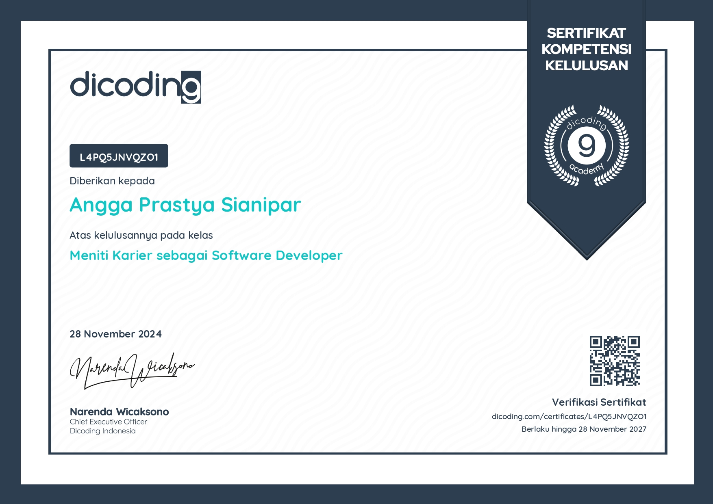
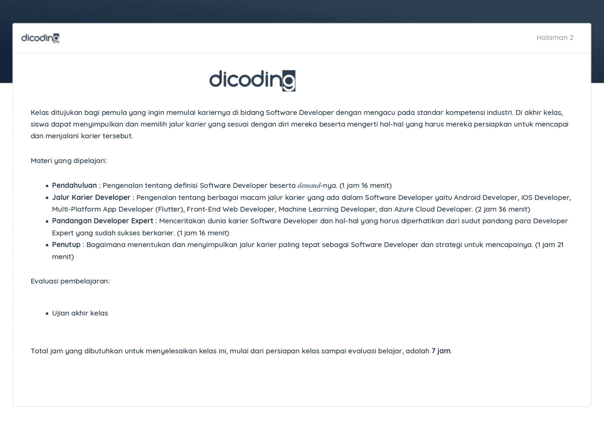

##  Deskripsi Sertifikasi Kompetensi

Sertifikat Kelulusan dengan nomor **No. L4PQ5JNVQZO1** ini diterbitkan secara resmi oleh **Dicoding Academy** kepada **Angga Prastya Sianipar**. Kredensial ini memvalidasi kelulusan dalam kelas pelatihan yang mengacu langsung pada standar kompetensi industri rekayasa perangkat lunak.

Kelas ini ditujukan bagi pengembangan kapabilitas profesional dasar guna memetakan jalur karier teknologi yang adaptif, terstruktur, serta memahami bekal teknis yang harus dipersiapkan untuk menembus pasar kerja global.

---

### Materi Pembelajaran & Evaluasi (Total 7 Jam)
* **Pendahuluan Dunia Pengembangan**: Memahami definisi fungsional Software Developer serta analisis kebutuhan (*demand*) industri teknologi modern (1 jam 16 menit).
* **Eksplorasi Jalur Karier Teknis**: Pengenalan mendalam tentang spesifikasi dan ekosistem pengerjaan pada ranah Android, iOS, Multi-Platform (Flutter), Front-End Web, Azure Cloud, hingga pengembangan kecerdasan buatan atau *Machine Learning Developer* (2 jam 36 menit).
* **Strategi & Pandangan Developer Expert**: Menyerap metodologi kerja, budaya industri, dan kiat sukses adaptasi teknologi dari sudut pandang para praktisi expert (1 jam 16 menit).
* **Penentuan Jalur & Rencana Aksi**: Perancangan strategi taktis untuk menentukan spesialisasi karier yang tepat serta penyusunan langkah pencapaiannya (1 jam 21 menit).
* **Evaluasi & Validasi**: Dinyatakan lulus setelah menyelesaikan seluruh materi pembelajaran dan melewati ujian akhir kelas.

> [!SUCCESS] Validitas Kredensial
> Sertifikat ini disahkan oleh **Narenda Wicaksono** selaku *Chief Executive Officer* Dicoding Indonesia pada **28 November 2024** dan berlaku penuh hingga **28 November 2027**. Tautan verifikasi resmi tersedia pada: `dicoding.com/certificates/L4PQ5JNVQZO1`.

  &times;
  
  &#10094;
  &#10095;

  

