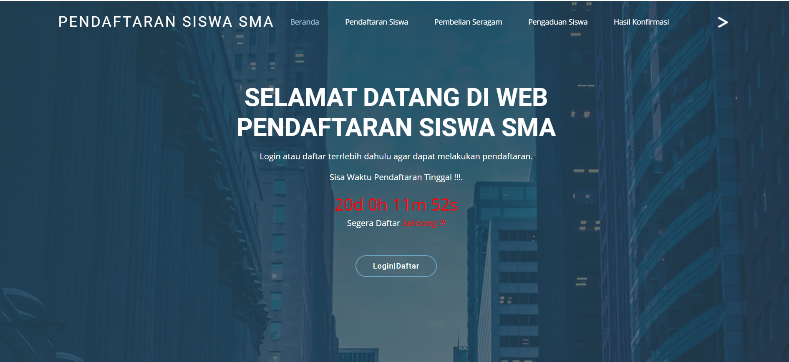

  &times;
  

  
  

    <svg width="24" height="24" viewBox="0 0 24 24" fill="none" stroke="white" stroke-width="2" stroke-linecap="round" stroke-linejoin="round"><path d="M15 3h6v6M9 21H3v-6M21 3l-7 7M3 21l7-7"/></svg>
  

Asri School is a web-based school information and student registration platform designed to efficiently manage student admissions and institutional workflows.

### Roles & Responsibilities:
* **Back-End Development:** Built a robust and secure server-side application architecture using PHP.
* **Database Management:** Structured and managed relational database operations using MySQL to securely handle student records.
* **Front-End Integration:** Implemented an intuitive and responsive user interface for applicants and administrative staff.

## About the Project

  <strong>Asri School</strong> was developed in response to the inefficiencies often found in traditional school administration processes, such as manual paperwork, long queues, and data management errors. Serving as an integrated school management system platform, Asri School focuses on providing fast, transparent, and practical online student registration services. 
    
  This platform is designed to make it easier for prospective students to apply from anywhere and to assist school administrators in organizing student data efficiently through a fully integrated PHP backend system.

### System Documentation

  

    
    
<svg width="24" height="24" viewBox="0 0 24 24" fill="none" stroke="white" stroke-width="2" stroke-linecap="round" stroke-linejoin="round"><path d="M15 3h6v6M9 21H3v-6M21 3l-7 7M3 21l7-7"/></svg>

  

  

    
    
<svg width="24" height="24" viewBox="0 0 24 24" fill="none" stroke="white" stroke-width="2" stroke-linecap="round" stroke-linejoin="round"><path d="M15 3h6v6M9 21H3v-6M21 3l-7 7M3 21l7-7"/></svg>

  

  
  

