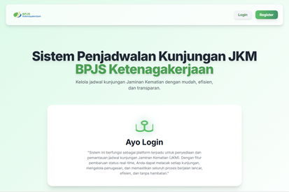

  &times;
  

  
  

    <svg width="20" height="20" viewBox="0 0 24 24" fill="none" stroke="currentColor" stroke-width="2" stroke-linecap="round" stroke-linejoin="round"><polyline points="15 3 21 3 21 9"></polyline><polyline points="9 21 3 21 3 15"></polyline><line x1="21" y1="3" x2="14" y2="10"></line><line x1="3" y1="21" x2="10" y2="14"></line></svg>
  

## About the Project

  <strong>JKM Visit Scheduling System</strong> is a web-based application specifically designed to optimize service operations at the BPJS Ketenagakerjaan (Social Security Administrator for Employment) Medan Kota Branch. This system serves as a solution to the challenges in field work visit management, particularly concerning the verification of <strong>Death Benefit (Jaminan Kematian - JKM)</strong> claims.
    
  Prior to this system, the assignment of visits to various regions was done manually, resulting in sluggish workflows, difficulties in tracking assignment statuses, and the risk of data duplication. Through this platform, administrators can structurally distribute tasks, document comprehensive visit details, and monitor assignment schedules in <em>real-time</em>. Powered by PHP and MySQL technologies, this system acts as an effective coordination tool—ensuring even task distribution, improving reporting accuracy, and ultimately enhancing the institution's overall operational quality in serving the participants' beneficiaries.

### System Documentation

  

<svg width="20" height="20" viewBox="0 0 24 24" fill="none" stroke="currentColor" stroke-width="2" stroke-linecap="round" stroke-linejoin="round"><polyline points="15 3 21 3 21 9"></polyline><polyline points="9 21 3 21 3 15"></polyline><line x1="21" y1="3" x2="14" y2="10"></line><line x1="3" y1="21" x2="10" y2="14"></line></svg>

  

<svg width="20" height="20" viewBox="0 0 24 24" fill="none" stroke="currentColor" stroke-width="2" stroke-linecap="round" stroke-linejoin="round"><polyline points="15 3 21 3 21 9"></polyline><polyline points="9 21 3 21 3 15"></polyline><line x1="21" y1="3" x2="14" y2="10"></line><line x1="3" y1="21" x2="10" y2="14"></line></svg>

  

<svg width="20" height="20" viewBox="0 0 24 24" fill="none" stroke="currentColor" stroke-width="2" stroke-linecap="round" stroke-linejoin="round"><polyline points="15 3 21 3 21 9"></polyline><polyline points="9 21 3 21 3 15"></polyline><line x1="21" y1="3" x2="14" y2="10"></line><line x1="3" y1="21" x2="10" y2="14"></line></svg>

  

<svg width="20" height="20" viewBox="0 0 24 24" fill="none" stroke="currentColor" stroke-width="2" stroke-linecap="round" stroke-linejoin="round"><polyline points="15 3 21 3 21 9"></polyline><polyline points="9 21 3 21 3 15"></polyline><line x1="21" y1="3" x2="14" y2="10"></line><line x1="3" y1="21" x2="10" y2="14"></line></svg>

  

<svg width="20" height="20" viewBox="0 0 24 24" fill="none" stroke="currentColor" stroke-width="2" stroke-linecap="round" stroke-linejoin="round"><polyline points="15 3 21 3 21 9"></polyline><polyline points="9 21 3 21 3 15"></polyline><line x1="21" y1="3" x2="14" y2="10"></line><line x1="3" y1="21" x2="10" y2="14"></line></svg>

  

<svg width="20" height="20" viewBox="0 0 24 24" fill="none" stroke="currentColor" stroke-width="2" stroke-linecap="round" stroke-linejoin="round"><polyline points="15 3 21 3 21 9"></polyline><polyline points="9 21 3 21 3 15"></polyline><line x1="21" y1="3" x2="14" y2="10"></line><line x1="3" y1="21" x2="10" y2="14"></line></svg>

  

<svg width="20" height="20" viewBox="0 0 24 24" fill="none" stroke="currentColor" stroke-width="2" stroke-linecap="round" stroke-linejoin="round"><polyline points="15 3 21 3 21 9"></polyline><polyline points="9 21 3 21 3 15"></polyline><line x1="21" y1="3" x2="14" y2="10"></line><line x1="3" y1="21" x2="10" y2="14"></line></svg>

