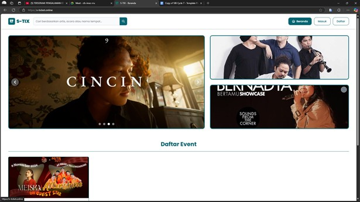

  &times;
  

  
  

    <svg width="24" height="24" viewBox="0 0 24 24" fill="none" stroke="white" stroke-width="2" stroke-linecap="round" stroke-linejoin="round"><path d="M15 3h6v6M9 21H3v-6M21 3l-7 7M3 21l7-7"/></svg>
  

S-TIX is an e-commerce platform designed to efficiently manage and facilitate concert ticket sales. This project was developed during the Kampus Merdeka Certified Independent Study (MSIB) Batch 7 program.

### Roles & Responsibilities:
* **Back-End Architecture:** Designed a secure and scalable API architecture using Node.js and the Hapi framework.
* **Database Design:** Structured an optimal database to handle real-time ticket transactions.
* **Front-End Development:** Optimized the application's UI/UX using React.
* **Testing:** Conducted comprehensive system testing (Unit, Integration, & E2E Testing).

## About the Project

  <strong>S-TIX</strong> was developed in response to the inefficiencies often found in traditional concert ticket sales systems, such as long queues and the risk of management errors. Serving as an integrated <em>Ticket Management System</em> (TMS) platform, S-TIX focuses on providing fast, secure, and practical <em>online</em> concert ticket sales services.
    
  This platform is designed to make it easier for audiences to access their favorite concert tickets and to assist event organizers in maximizing their audience reach through a fully integrated system.

### System Documentation

  

    
    
<svg width="24" height="24" viewBox="0 0 24 24" fill="none" stroke="white" stroke-width="2" stroke-linecap="round" stroke-linejoin="round"><path d="M15 3h6v6M9 21H3v-6M21 3l-7 7M3 21l7-7"/></svg>

  

  

    
    
<svg width="24" height="24" viewBox="0 0 24 24" fill="none" stroke="white" stroke-width="2" stroke-linecap="round" stroke-linejoin="round"><path d="M15 3h6v6M9 21H3v-6M21 3l-7 7M3 21l7-7"/></svg>

  

  

    
    
<svg width="24" height="24" viewBox="0 0 24 24" fill="none" stroke="white" stroke-width="2" stroke-linecap="round" stroke-linejoin="round"><path d="M15 3h6v6M9 21H3v-6M21 3l-7 7M3 21l7-7"/></svg>

  

  

    
    
<svg width="24" height="24" viewBox="0 0 24 24" fill="none" stroke="white" stroke-width="2" stroke-linecap="round" stroke-linejoin="round"><path d="M15 3h6v6M9 21H3v-6M21 3l-7 7M3 21l7-7"/></svg>

  

  

    
    
<svg width="24" height="24" viewBox="0 0 24 24" fill="none" stroke="white" stroke-width="2" stroke-linecap="round" stroke-linejoin="round"><path d="M15 3h6v6M9 21H3v-6M21 3l-7 7M3 21l7-7"/></svg>

  

  

    
    
<svg width="24" height="24" viewBox="0 0 24 24" fill="none" stroke="white" stroke-width="2" stroke-linecap="round" stroke-linejoin="round"><path d="M15 3h6v6M9 21H3v-6M21 3l-7 7M3 21l7-7"/></svg>

  

  

    
    
<svg width="24" height="24" viewBox="0 0 24 24" fill="none" stroke="white" stroke-width="2" stroke-linecap="round" stroke-linejoin="round"><path d="M15 3h6v6M9 21H3v-6M21 3l-7 7M3 21l7-7"/></svg>

  

  

