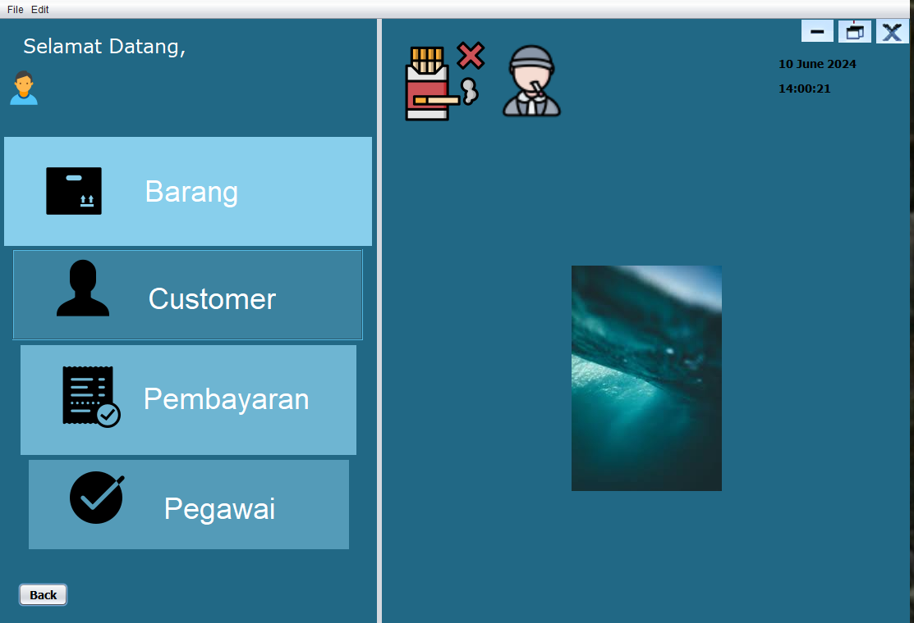

  &times;
  

  
  

    <svg width="20" height="20" viewBox="0 0 24 24" fill="none" stroke="currentColor" stroke-width="2" stroke-linecap="round" stroke-linejoin="round"><polyline points="15 3 21 3 21 9"></polyline><polyline points="9 21 3 21 3 15"></polyline><line x1="21" y1="3" x2="14" y2="10"></line><line x1="3" y1="21" x2="10" y2="14"></line></svg>
  

## About the Project

  <strong>Java Desktop School Information and Management System</strong>   is a comprehensive desktop-based application specifically designed to manage school administration and student records. This system serves as an integrated solution for institutional operational workflows, handling everything from student data tracking to financial transactions.</strong> claims.
    
  Prior to this system, administrative processes were often manual, fragmented, and lacked efficiency. Through this platform, operators can seamlessly authenticate users, manage student information, track uniform inventory catalogs, process payments, and monitor staff attendance in real-time. Built using Java and NetBeans with a structured relational database backend, this system acts as an effective administrative tool—ensuring data accuracy, streamlining transaction reports, and optimizing overall school management operations.

### System Documentation

  

<svg width="20" height="20" viewBox="0 0 24 24" fill="none" stroke="currentColor" stroke-width="2" stroke-linecap="round" stroke-linejoin="round"><polyline points="15 3 21 3 21 9"></polyline><polyline points="9 21 3 21 3 15"></polyline><line x1="21" y1="3" x2="14" y2="10"></line><line x1="3" y1="21" x2="10" y2="14"></line></svg>

  

<svg width="20" height="20" viewBox="0 0 24 24" fill="none" stroke="currentColor" stroke-width="2" stroke-linecap="round" stroke-linejoin="round"><polyline points="15 3 21 3 21 9"></polyline><polyline points="9 21 3 21 3 15"></polyline><line x1="21" y1="3" x2="14" y2="10"></line><line x1="3" y1="21" x2="10" y2="14"></line></svg>

  

<svg width="20" height="20" viewBox="0 0 24 24" fill="none" stroke="currentColor" stroke-width="2" stroke-linecap="round" stroke-linejoin="round"><polyline points="15 3 21 3 21 9"></polyline><polyline points="9 21 3 21 3 15"></polyline><line x1="21" y1="3" x2="14" y2="10"></line><line x1="3" y1="21" x2="10" y2="14"></line></svg>

<svg width="20" height="20" viewBox="0 0 24 24" fill="none" stroke="currentColor" stroke-width="2" stroke-linecap="round" stroke-linejoin="round"><polyline points="15 3 21 3 21 9"></polyline><polyline points="9 21 3 21 3 15"></polyline><line x1="21" y1="3" x2="14" y2="10"></line><line x1="3" y1="21" x2="10" y2="14"></line></svg>

<svg width="20" height="20" viewBox="0 0 24 24" fill="none" stroke="currentColor" stroke-width="2" stroke-linecap="round" stroke-linejoin="round"><polyline points="15 3 21 3 21 9"></polyline><polyline points="9 21 3 21 3 15"></polyline><line x1="21" y1="3" x2="14" y2="10"></line><line x1="3" y1="21" x2="10" y2="14"></line></svg>

<svg width="20" height="20" viewBox="0 0 24 24" fill="none" stroke="currentColor" stroke-width="2" stroke-linecap="round" stroke-linejoin="round"><polyline points="15 3 21 3 21 9"></polyline><polyline points="9 21 3 21 3 15"></polyline><line x1="21" y1="3" x2="14" y2="10"></line><line x1="3" y1="21" x2="10" y2="14"></line></svg>

